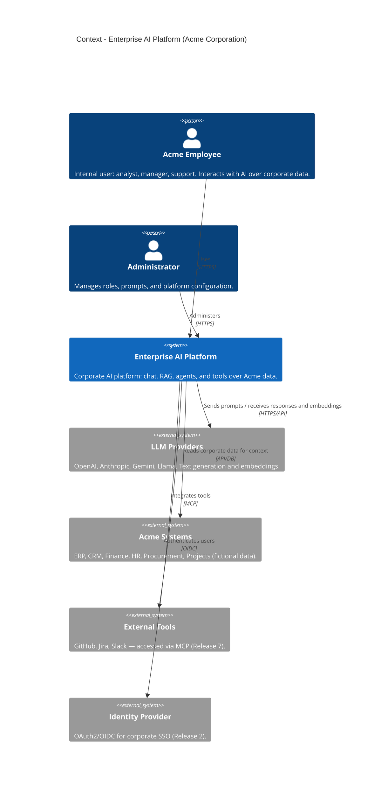

# C4 — Level 1: Context Diagram

> Broadest view: **who** uses the platform and **which external systems** it talks to.
> No internal detail — that comes in Level 2 (Containers).

## Diagram

## Reading the diagram

- **Actors (Person):** Acme's internal users. There is no anonymous internet user —
  the platform is **internal and authenticated**. (This is why SEO is irrelevant, and
  why the Next.js choice is justified by SSO/BFF and streaming, not by indexing.)
- **Central system:** the Enterprise AI Platform — the box we are going to build.
- **External systems:**
  - **LLM Providers** — source of the AI capability (text and embeddings).
  - **Acme Systems** — where corporate data comes from (context for RAG).
  - **External Tools** — GitHub/Jira/Slack via MCP (Release 7).
  - **Identity Provider** — enables SSO (Release 2).

## Boundaries and responsibilities

The platform is the **sole** owner of AI orchestration. External systems are either
*providers* (LLMs, identity) or *data sources* (Acme systems). No external system knows
the platform's internals — every integration goes through well-defined contracts (API,
OIDC, MCP).

## Next level

**Level 2 (Containers)** will open the "Enterprise AI Platform" box into: Next.js
frontend (UI + BFF), FastAPI API (the modular monolith), PostgreSQL, and Redis. It will
be drawn as part of the Release 1 architecture tasks.
