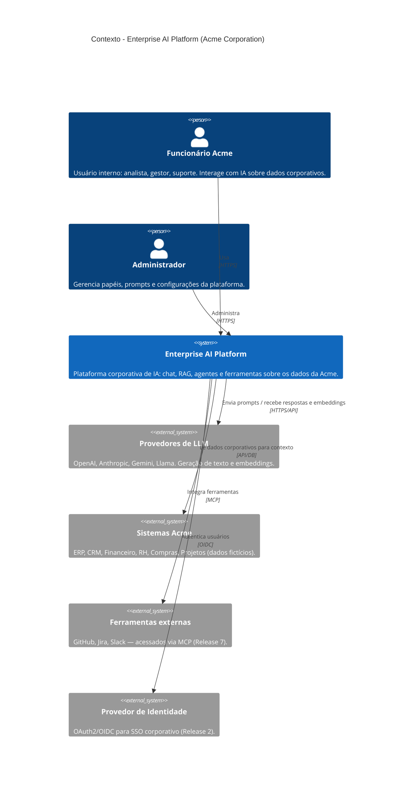

# C4 — Nível 1: Diagrama de Contexto

> Visão mais ampla: **quem** usa a plataforma e com **quais sistemas externos** ela
> conversa. Sem detalhes internos — esses vêm no Nível 2 (Contêineres).

## Diagrama

## Leitura do diagrama

- **Atores (Person):** os usuários internos da Acme. Não há usuário anônimo da
  internet — a plataforma é **interna e autenticada**. (Por isso SEO é irrelevante e
  a escolha de Next.js se justifica por SSO/BFF e streaming, não por indexação.)
- **Sistema central:** a Enterprise AI Platform — a caixa que vamos construir.
- **Sistemas externos:**
  - **Provedores de LLM** — fonte da capacidade de IA (texto e embeddings).
  - **Sistemas Acme** — de onde vêm os dados corporativos (contexto para RAG).
  - **Ferramentas externas** — GitHub/Jira/Slack via MCP (Release 7).
  - **Provedor de Identidade** — habilita o SSO (Release 2).

## Fronteiras e responsabilidades

A plataforma é a **única** dona da orquestração de IA. Os sistemas externos são
*fornecedores* (LLMs, identidade) ou *fontes de dados* (sistemas Acme). Nenhum
sistema externo conhece os detalhes internos da plataforma — toda integração passa
por contratos bem definidos (API, OIDC, MCP).

## Próximo nível

O **Nível 2 (Contêineres)** abrirá a caixa "Enterprise AI Platform" em: Frontend
Next.js (UI + BFF), API FastAPI (o monólito modular), PostgreSQL e Redis. Será
desenhado como parte das tarefas de arquitetura do Release 1.
