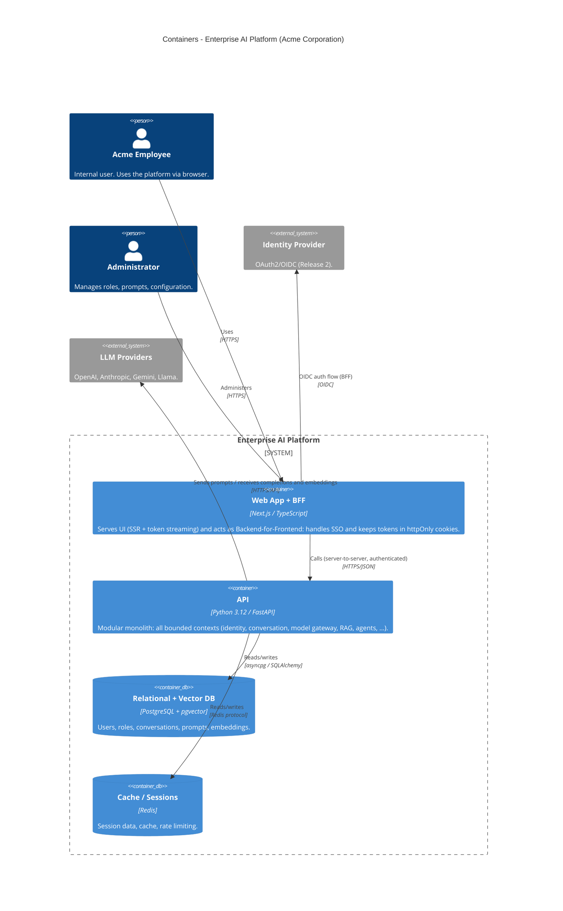

# C4 — Level 2: Container Diagram

> Opens the "Enterprise AI Platform" box from Level 1 into its **containers** —
> separately deployable runtime units (apps, APIs, databases), *not* Docker containers.
> Answers: which building blocks make up the platform, and how do they talk?

## Diagram

## Reading the diagram

- **Web App + BFF (Next.js):** the only container exposed to the browser. It serves the
  UI and acts as a **Backend-for-Frontend (BFF)** — the OIDC/SSO flow happens here and
  tokens live in httpOnly cookies, never reaching browser JavaScript. It never talks to
  the database directly; it calls the API server-to-server.
- **API (FastAPI):** the **modular monolith** (see
  [ADR-0001](../decisions/ADR-0001-modular-monolith.md)). All bounded contexts live
  here as internal modules. It is the sole owner of business logic and the only
  container that talks to the data stores and LLM providers.
- **PostgreSQL (+ pgvector):** the system of record. Relational data now; vector
  embeddings added in Release 8 via the pgvector extension (same container, no extra
  infrastructure).
- **Redis:** sessions, cache, and rate limiting.

## Key boundaries

1. **Browser → only the Web App.** The API is not publicly exposed; the BFF is the
   single front door. This shrinks the attack surface and centralizes auth.
2. **Web → API is server-to-server and authenticated.** The frontend holds no
   long-lived secrets in the browser.
3. **Only the API touches the databases and LLM providers.** Data access and AI
   orchestration are never done from the frontend.

## Evolution notes

- **pgvector before Qdrant:** we start with vectors *inside* PostgreSQL to avoid adding
  a new container. Qdrant becomes its own container only if Release 8 shows real need
  (scale, advanced filtering). This mirrors the modular-monolith philosophy: add
  infrastructure when pain is measured, not before.
- **Future containers:** RabbitMQ and background workers appear here only when a module
  is extracted into its own service (see ADR-0001 evolution criteria).

## Next level

**Level 3 (Components)** would open a single container — most likely the FastAPI API —
into its internal modules. We will draw it only when a module is complex enough to
justify it (e.g. the agent orchestration in Release 9).
